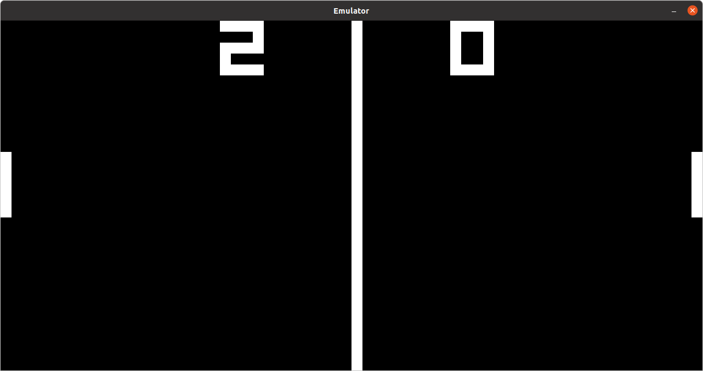
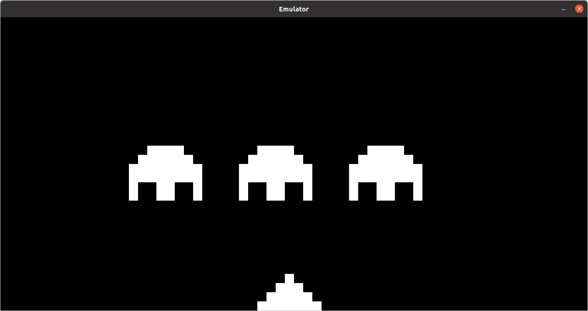
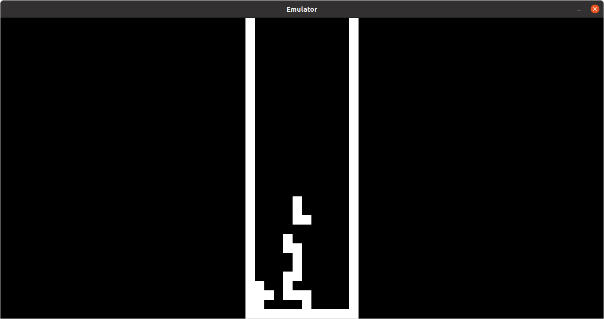

# Chip8-Emulator
Chip8-Emulator written in c++  for teaching me about emulation

You need install SDL2  to compile the project.

To Run use in terminal the following instructions: 
 make 
 ./Chip8 size_screen clock Rom/gameName (For example : ./Chip8 20 2 Rom/tetris.ch8)
 
 Images of Emulator running:
     
     
     
 
 
 
